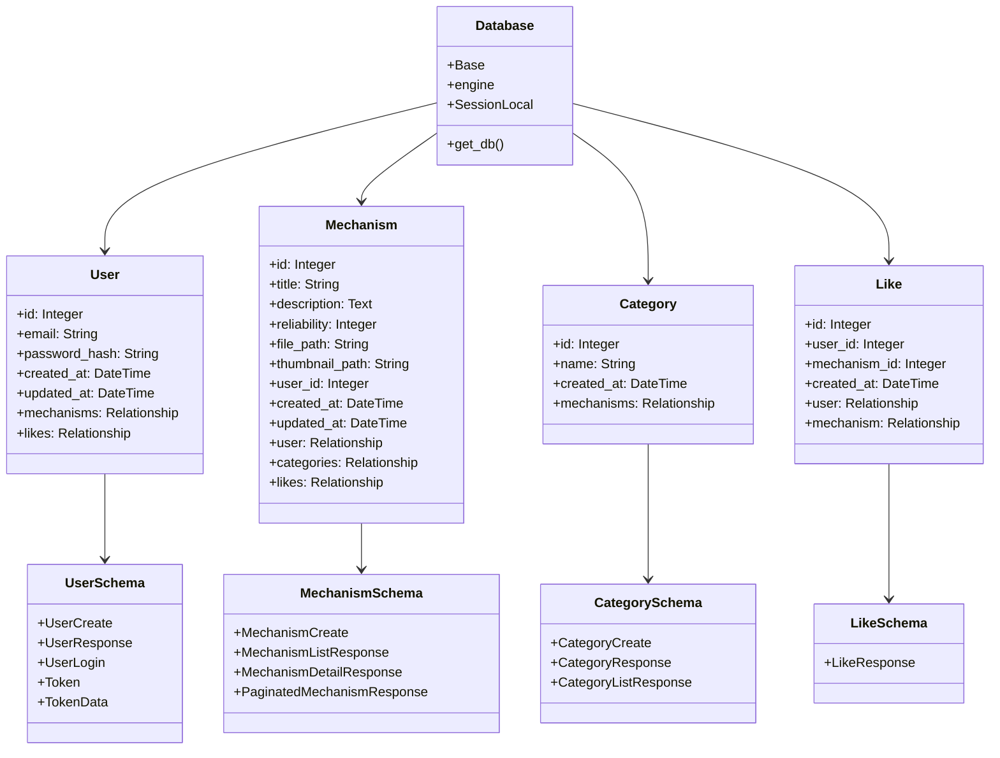

# バックエンド設計図

## アーキテクチャ図



## アプリケーション構造

```
backend/
├── app/
│   ├── models/           # SQLAlchemyモデル
│   │   ├── user.py
│   │   ├── mechanism.py
│   │   ├── category.py
│   │   └── like.py
│   ├── schemas/          # Pydanticスキーマ
│   │   ├── user.py
│   │   ├── mechanism.py
│   │   ├── category.py
│   │   └── like.py
│   ├── routers/          # APIエンドポイント
│   ├── services/         # ビジネスロジック
│   ├── middlewares/      # ミドルウェア
│   ├── utils/            # ユーティリティ関数
│   ├── database.py       # データベース設定
│   ├── config.py         # アプリケーション設定
│   └── main.py           # アプリケーションエントリーポイント
└── tests/                # テスト
```

## データベースモデル

### User
- ユーザー情報を管理するモデル
- メールアドレスとパスワードハッシュを保存
- メカニズムといいねへの関連を持つ

### Mechanism
- メカニズム情報を管理するモデル
- タイトル、説明、信頼性レベル、ファイルパスなどを保存
- ユーザー、カテゴリー、いいねへの関連を持つ

### Category
- カテゴリー情報を管理するモデル
- カテゴリー名を保存
- メカニズムへの関連を持つ

### Like
- いいね情報を管理するモデル
- ユーザーとメカニズムの関連を保存
- 一人のユーザーが同じメカニズムに複数回いいねできないようにユニーク制約を持つ

## Pydanticスキーマ

### UserSchema
- UserCreate: ユーザー作成用スキーマ
- UserResponse: ユーザー情報表示用スキーマ
- UserLogin: ユーザー認証用スキーマ
- Token: トークン用スキーマ
- TokenData: トークンデータ用スキーマ

### MechanismSchema
- MechanismCreate: メカニズム作成用スキーマ
- MechanismListResponse: メカニズム一覧表示用スキーマ
- MechanismDetailResponse: メカニズム詳細表示用スキーマ
- PaginatedMechanismResponse: ページネーション用スキーマ

### CategorySchema
- CategoryCreate: カテゴリー作成用スキーマ
- CategoryResponse: カテゴリー情報表示用スキーマ
- CategoryListResponse: カテゴリー一覧表示用スキーマ

### LikeSchema
- LikeResponse: いいね情報表示用スキーマ

## データフロー

1. クライアントからのリクエストがAPIエンドポイント（routers）に到達
2. ルーターがリクエストを適切なサービス（services）に転送
3. サービスがビジネスロジックを実行し、必要に応じてデータベースにアクセス
4. データベースからの結果をPydanticスキーマに変換して返却
5. レスポンスがクライアントに返される

## 認証フロー

1. ユーザーがログインリクエストを送信
2. パスワードが検証され、正しい場合はJWTトークンが生成
3. トークンがクライアントに返され、以降のリクエストに使用される
4. 保護されたエンドポイントでは、リクエストヘッダーからトークンを取得して検証
5. トークンが有効な場合、リクエストが処理される
