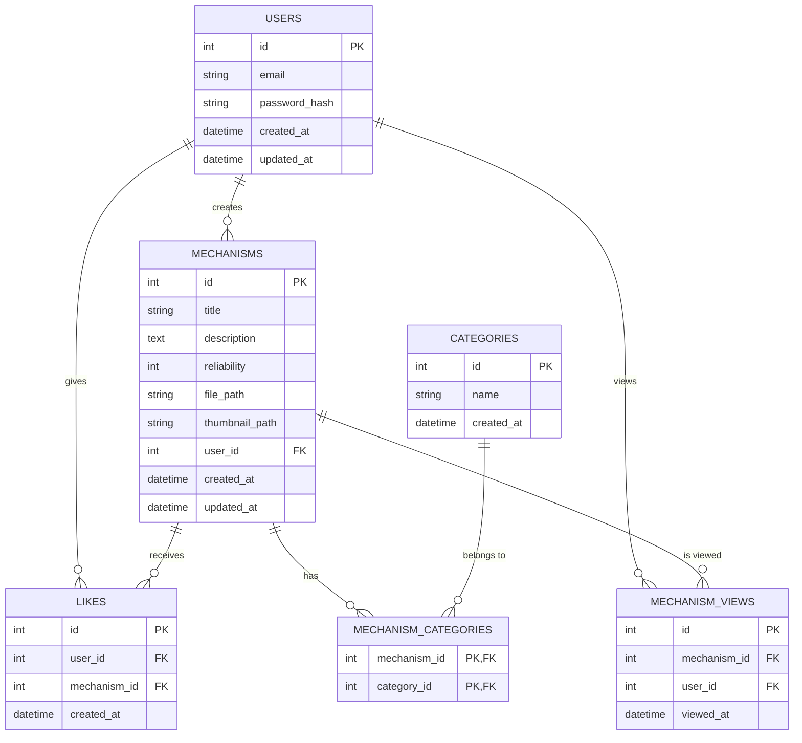

# データベース設計図

## ER図

## テーブル定義

### users テーブル
| カラム名 | データ型 | 制約 | 説明 |
|---------|---------|------|------|
| id | Integer | PK, index | ユーザーID |
| email | String | unique, index, not null | メールアドレス |
| password_hash | String | not null | パスワードハッシュ |
| created_at | DateTime | not null, default=now() | 作成日時 |
| updated_at | DateTime | not null, default=now(), onupdate=now() | 更新日時 |

### mechanisms テーブル
| カラム名 | データ型 | 制約 | 説明 |
|---------|---------|------|------|
| id | Integer | PK, index | メカニズムID |
| title | String | not null | タイトル |
| description | Text | not null | 説明 |
| reliability | Integer | not null | 信頼性レベル (1-5) |
| file_path | String | not null | ファイルパス |
| thumbnail_path | String | nullable | サムネイルパス |
| user_id | Integer | FK(users.id), not null | 投稿者ID |
| created_at | DateTime | not null, default=now() | 作成日時 |
| updated_at | DateTime | not null, default=now(), onupdate=now() | 更新日時 |

### categories テーブル
| カラム名 | データ型 | 制約 | 説明 |
|---------|---------|------|------|
| id | Integer | PK, index | カテゴリーID |
| name | String | unique, not null | カテゴリー名 |
| created_at | DateTime | not null, default=now() | 作成日時 |

### likes テーブル
| カラム名 | データ型 | 制約 | 説明 |
|---------|---------|------|------|
| id | Integer | PK, index | いいねID |
| user_id | Integer | FK(users.id), not null | ユーザーID |
| mechanism_id | Integer | FK(mechanisms.id), not null | メカニズムID |
| created_at | DateTime | not null, default=now() | 作成日時 |

**ユニーク制約**: (user_id, mechanism_id) - 一人のユーザーが同じメカニズムに複数回いいねできないようにする制約

### mechanism_categories テーブル (中間テーブル)
| カラム名 | データ型 | 制約 | 説明 |
|---------|---------|------|------|
| mechanism_id | Integer | PK, FK(mechanisms.id) | メカニズムID |
| category_id | Integer | PK, FK(categories.id) | カテゴリーID |

### mechanism_views テーブル
| カラム名 | データ型 | 制約 | 説明 |
|---------|---------|------|------|
| id | Integer | PK, index | 閲覧履歴ID |
| mechanism_id | Integer | FK(mechanisms.id), not null | メカニズムID |
| user_id | Integer | FK(users.id), nullable | ユーザーID（匿名ユーザーの場合はNULL） |
| viewed_at | DateTime | not null, default=now() | 閲覧日時 |

## リレーションシップ

- User (1) - (0..*) Mechanism: ユーザーは複数のメカニズムを投稿できる
- User (1) - (0..*) Like: ユーザーは複数のいいねを付けられる
- User (1) - (0..*) MechanismView: ユーザーは複数のメカニズムを閲覧できる
- Mechanism (1) - (0..*) Like: メカニズムは複数のいいねを受け取れる
- Mechanism (1) - (0..*) MechanismView: メカニズムは複数回閲覧される
- Mechanism (0..*) - (0..*) Category: メカニズムと複数のカテゴリーは多対多の関係
