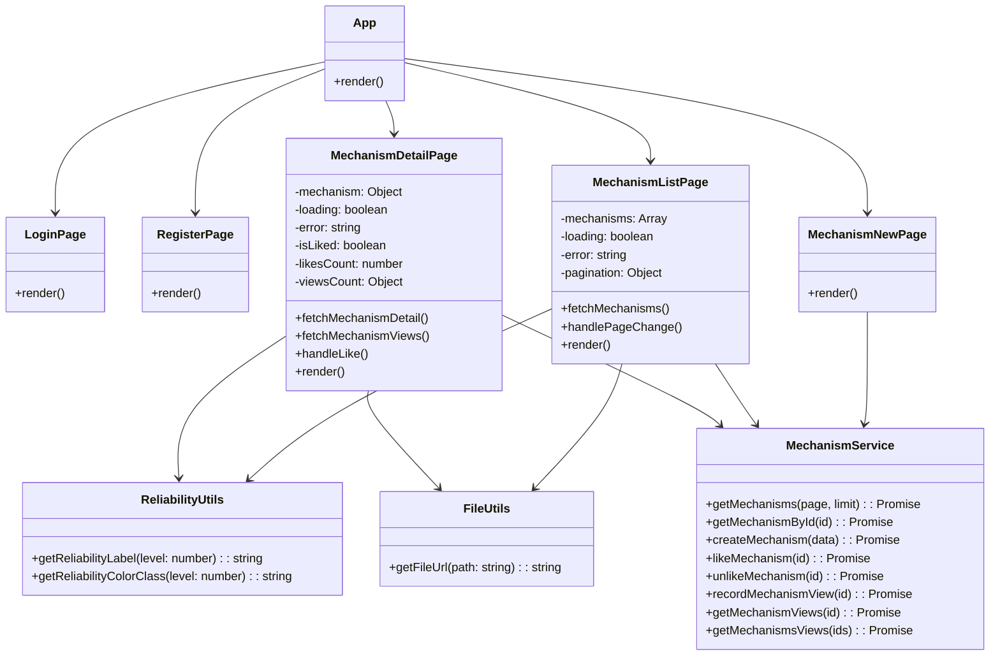

# フロントエンド設計図

## コンポーネント構造図



## ページコンポーネント

### App
- メインのアプリケーションコンポーネント
- React Routerを使用してルーティングを管理
- 各ページへのルートを定義

### LoginPage
- ユーザーログイン機能を提供
- メールアドレスとパスワードによる認証

### RegisterPage
- 新規ユーザー登録機能を提供
- メールアドレスとパスワードによるアカウント作成

### MechanismListPage
- メカニズム一覧を表示
- ページネーション機能を提供
- 各メカニズムのタイトル、説明、信頼性レベル、カテゴリー、いいね数、閲覧回数を表示
- サムネイル画像を表示（存在する場合）

### MechanismDetailPage
- 特定のメカニズムの詳細情報を表示
- メカニズムのタイトル、説明、信頼性、カテゴリー、ファイル情報などを表示
- いいね機能を提供
- 閲覧回数（総閲覧回数とユーザー個人の閲覧回数）を表示
- ファイル表示とダウンロード機能を提供

### MechanismNewPage
- 新しいメカニズムを投稿するためのフォームを提供
- タイトル、説明、信頼性レベル、カテゴリー、ファイルのアップロード機能
- サムネイル画像のアップロード機能（オプション）

## ユーティリティ

### ReliabilityUtils
- 信頼性レベルに関する機能を提供
- 信頼性レベルを数値から文字列に変換する関数
- 信頼性レベルに応じた背景色とテキスト色のクラス名を返す関数

### FileUtils
- ファイル関連のユーティリティ関数を提供
- ファイルパスをフルURLに変換する関数

## サービス

### MechanismService
- メカニズム関連のAPI呼び出しを行うサービス
- メカニズム一覧取得機能
- メカニズム詳細取得機能
- メカニズム作成機能
- いいね機能
- いいね取り消し機能
- 閲覧履歴記録機能
- 閲覧回数取得機能
- 複数メカニズムの閲覧回数一括取得機能

## コンポーネントディレクトリ構造

```
frontend/src/
├── components/
│   ├── auth/         # 認証関連コンポーネント
│   ├── common/       # 共通コンポーネント
│   ├── layout/       # レイアウト関連コンポーネント
│   └── mechanism/    # メカニズム関連コンポーネント
├── contexts/         # Reactコンテキスト
├── hooks/            # カスタムフック
├── pages/            # ページコンポーネント
├── services/         # APIサービス
├── types/            # 型定義
└── utils/            # ユーティリティ関数
```

## データフロー

1. ユーザーがアプリケーションにアクセス
2. App.tsxがルーティングを処理し、適切なページコンポーネントをレンダリング
3. ページコンポーネントが必要に応じてAPIサービスを使用してバックエンドからデータを取得
4. 取得したデータをコンポーネントの状態として保存し、UIをレンダリング
5. ユーザーのアクションに応じて、APIサービスを通じてバックエンドにデータを送信

## 認証フロー

1. ユーザーがLoginPageまたはRegisterPageでフォームを送信
2. APIサービスがバックエンドに認証リクエストを送信
3. 認証成功時、トークンをローカルストレージに保存
4. 認証が必要なページでは、トークンを使用してAPIリクエストを認証

## メカニズム閲覧回数記録フロー

1. ユーザーがメカニズム詳細画面にアクセス
2. MechanismDetailPageコンポーネントがマウントされる
3. useEffectフックでMechanismService.getMechanismByIdを呼び出してメカニズム詳細を取得
4. メカニズム詳細取得後、MechanismService.recordMechanismViewを呼び出して閲覧履歴を記録
5. MechanismService.getMechanismViewsを呼び出して閲覧回数を取得
6. 取得した閲覧回数（総閲覧回数とユーザー個人の閲覧回数）を表示
